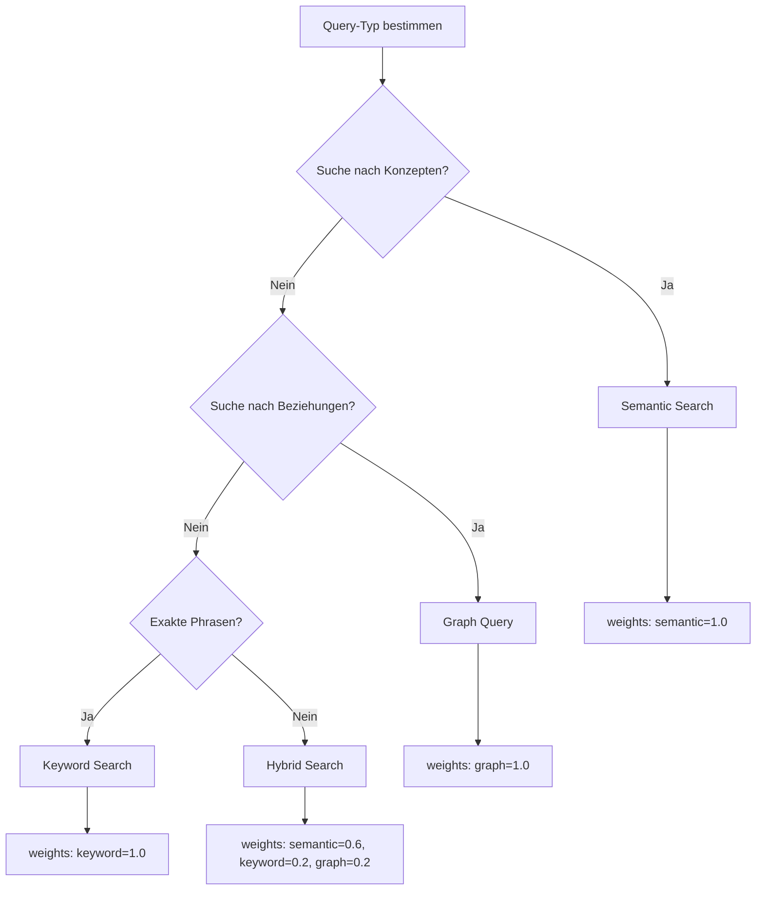

# GraphRAG Guide

Graph-based Retrieval Augmented Generation (GraphRAG) combines semantic search with structured graph relationships for enhanced knowledge discovery and contextual understanding.

## Konzept: Wann Vector vs. Graph?

Das Cognitive Memory System bietet drei Suchstrategien, die je nach Anwendungsfall optimal kombiniert werden können.

### Semantic Search (Vektor-Suche)

**Einsatzbereich:** Natürlichsprachliche Ähnlichkeit und konzeptuelle Übereinstimmung

```python
# Perfekt für: "Finde ähnliche Konzepte"
results = await mcp_server.call_tool("hybrid_search", {
    "query_text": "Wie geht ihr mit Speicherplatzproblemen um?",
    "weights": {"semantic": 1.0, "keyword": 0.0, "graph": 0.0}
})
```

**Stärken:**
- Findet thematisch verwandte Inhalte
- Versteht Synonyme und konzeptuelle Beziehungen
- Ideal für explorative Suche

**Schwächen:**
- Keine Kenntnis von strukturierten Beziehungen
- Kann wichtige Verbindungen übersehen

### Graph Search (Strukturierte Suche)

**Einsatzbereich:** Analyse definierter Beziehungen und Abhängigkeiten

```python
# Perfekt für: "Welche Technologien verwendet dieses Projekt?"
await mcp_server.call_tool("graph_query_neighbors", {
    "node_name": "Cognitive Memory System",
    "relation_type": "USES",
    "depth": 1
})
```

**Stärken:**
- Exakte Beziehungsanalyse
- Verfolgt definierte Abhängigkeitsketten
- Konsistente Ergebnismenge

**Schwächen:**
- Benötigt vorstrukturierte Daten
- Keine semantische Flexibilität

### Hybrid Search (Optimale Kombination)

Die empfohlene Konfiguration für die meisten Anwendungsfälle:

```yaml
hybrid_search_weights:
  semantic: 0.6  # 60% konzeptuelle Ähnlichkeit
  keyword: 0.2   # 20% exakte Treffer
  graph: 0.2     # 20% strukturierte Beziehungen
```

**Beispiel: Architecture Check**
```python
# Kombiniert: Finde PostgreSQL-Lösungen für Hochleistungsanforderungen
results = await mcp_server.call_tool("hybrid_search", {
    "query_text": "High Volume Requirement",
    "weights": {"semantic": 0.6, "keyword": 0.2, "graph": 0.2}
})
# Ergebnis: Lösungen die konzeptuell passen UND PostgreSQL als Datenbank nutzen
```

### Entscheidungsbaum für Query-Typ



## Best Practices für Entity-Typen (Labels)

### Empfohlene Labels

Verwende diese standardisierten Labels für konsistente Graph-Strukturen:

#### Project
Projekte, Features, Epics, User Stories
```python
await mcp_server.call_tool("graph_add_node", {
    "label": "Project",
    "name": "Cognitive Memory System",
    "properties": {
        "status": "active",
        "priority": "high",
        "start_date": "2025-01-15",
        "epic": "GraphRAG Integration"
    }
})
```

#### Technology
Frameworks, Datenbanken, APIs, Tools, Libraries
```python
await mcp_server.call_tool("graph_add_node", {
    "label": "Technology",
    "name": "PostgreSQL",
    "properties": {
        "type": "database",
        "version": "15+",
        "category": "storage",
        "license": "opensource"
    }
})
```

#### Client
Kunden, Nutzergruppen, Stakeholder, Abteilungen
```python
await mcp_server.call_tool("graph_add_node", {
    "label": "Client",
    "name": "Finance Department",
    "properties": {
        "industry": "banking",
        "size": "enterprise",
        "region": "EMEA"
    }
})
```

#### Error
Fehler, Bugs, Probleme, Herausforderungen
```python
await mcp_server.call_tool("graph_add_node", {
    "label": "Error",
    "name": "High Latency on Queries",
    "properties": {
        "severity": "critical",
        "category": "performance",
        "first_seen": "2025-01-20"
    }
})
```

#### Solution
Lösungen, Architekturentscheidungen, Patterns
```python
await mcp_server.call_tool("graph_add_node", {
    "label": "Solution",
    "name": "Vector Index Optimization",
    "properties": {
        "approach": "hnsw",
        "complexity": "medium",
        "impact": "high"
    }
})
```

#### Requirement
Anforderungen, Constraints, Spezifikationen
```python
await mcp_server.call_tool("graph_add_node", {
    "label": "Requirement",
    "name": "GDPR Compliance",
    "properties": {
        "category": "legal",
        "mandatory": true,
        "deadline": "2025-06-01"
    }
})
```

### Naming Conventions

**Labels:**
- **CamelCase**: `Project`, `Technology`, `Client`
- **Konsistent**: Verwende die gleiche Schreibweise
- **Beschreibend**: Label sollte den Typ klar beschreiben

**Node Names:**
- **Descriptive**: "Cognitive Memory System" statt "CMS"
- **Unique**: Keine Duplikate innerhalb des gleichen Labels
- **Stable**: Namen ändern sich selten

**Properties:**
- **Snake Case**: `start_date`, `team_size`
- **Typed**: Konsistente Datentypen (ISO-Dates, Enums)
- **Structured**: Verschachtelte Objekte für komplexe Metadaten

### Anti-Patterns vermeiden

**❌ Schlecht:**
```python
# Zu generisches Label
await mcp_server.call_tool("graph_add_node", {
    "label": "Item",
    "name": "Thing",
    # ...
})

# Inkonsistente Namensgebung
await mcp_server.call_tool("graph_add_node", {
    "label": "project",
    "name": " cognitive_memory  ",
    # ...
})
```

**✅ Gut:**
```python
# Spezifisches Label
await mcp_server.call_tool("graph_add_node", {
    "label": "Project",
    "name": "Cognitive Memory System",
    # ...
})
```

## Best Practices für Relation-Typen

### Standardisierte Relations-Tabelle

| Relation | Pattern | Beispiel | Use Case |
|----------|---------|----------|----------|
| `USES` | Entity → Technology | Project → Database | Abhängigkeiten, Tech Stack |
| `SOLVES` | Solution → Problem | Architecture → Performance | Problemlösungen |
| `CREATED_BY` | Entity → Agent | Code → Developer | Attribution, Verantwortung |
| `RELATED_TO` | Entity ↔ Entity | Requirement ↔ Feature | Allgemeine Verknüpfungen |
| `DEPENDS_ON` | Task → Prerequisite | Feature → API | Abhängigkeiten, Reihenfolge |

### Relations im Detail

#### USES (Abhängigkeiten)
**Pattern:** Project/Feature → Technology/Tool/API

```python
await mcp_server.call_tool("graph_add_edge", {
    "source_name": "Cognitive Memory System",
    "target_name": "PostgreSQL",
    "relation": "USES",
    "weight": 0.9,
    "properties": {
        "critical": true,
        "usage": "primary_database",
        "version_constraint": ">=15"
    }
})
```

**Typische USES-Beziehungen:**
- Project → Framework (React, Django)
- Service → Database (PostgreSQL, Redis)
- API → Library (OpenAI, Anthropic)

#### SOLVES (Problemlösungen)
**Pattern:** Solution → Problem/Error/Requirement

```python
await mcp_server.call_tool("graph_add_edge", {
    "source_name": "Vector Storage with pgvector",
    "target_name": "High Volume Requirement",
    "relation": "SOLVES",
    "weight": 0.85,
    "properties": {
        "effectiveness": "high",
        "implementation_effort": "medium"
    }
})
```

**Typische SOLVES-Beziehungen:**
- Architecture → Performance Problem
- Design Pattern → Code Quality Issue
- Technology → Business Requirement

#### CREATED_BY (Attribution)
**Pattern:** Entity → Agent/User/Team

```python
await mcp_server.call_tool("graph_add_edge", {
    "source_name": "GraphRAG Integration",
    "target_name": "Development Team Alpha",
    "relation": "CREATED_BY",
    "properties": {
        "role": "implementation",
        "contribution_type": "feature"
    }
})
```

**Typische CREATED_BY-Beziehungen:**
- Code → Developer
- Decision → Architect
- Documentation → Technical Writer

#### RELATED_TO (Allgemeine Verknüpfungen)
**Pattern:** Entity ↔ Entity (beliebige Beziehung)

```python
await mcp_server.call_tool("graph_add_edge", {
    "source_name": "GDPR Compliance",
    "target_name": "Data Encryption",
    "relation": "RELATED_TO",
    "weight": 0.7,
    "properties": {
        "relationship_type": "requirement-to-solution"
    }
})
```

**Typische RELATED_TO-Beziehungen:**
- Feature ↔ Business Requirement
- Error ↔ Solution
- Documentation ↔ Code

### Direktionalität

**Source → Target Bedeutung:**
- **USE_directional**: Project USES Technology (nicht umgekehrt)
- **SOLVE_directional**: Solution SOLVES Problem (nicht umgekehrt)
- **BIDIRECTIONAL**: RELATED_TO kann in beide Richtungen traversiert werden

### Weight-Verwendung

**Gewichtungsfaktoren:**
- **1.0**: Kritische Beziehung, immer vorhanden
- **0.8-0.9**: Starke Beziehung, meist relevant
- **0.5-0.7**: Normale Beziehung, kontextabhängig
- **0.3-0.4**: Schwache Beziehung, optional

## BMAD-BMM Workflows

### Use Case 1: Architecture Check

**Szenario:** Finde passende Technologien für neue Anforderungen

**Workflow:**
1. Requirement analysieren
2. Ähnliche Projekte finden
3. Verwendete Technologien identifizieren
4. Empfehlungen generieren

**Beispiel-Implementierung:**
```python
async def architecture_check(requirement_text):
    """Finde passende Technologien für eine Anforderung"""

    # 1. Requirement im Graphen erstellen/finden
    await mcp_server.call_tool("graph_add_node", {
        "label": "Requirement",
        "name": requirement_text,
        "properties": {"analysis_date": "2025-11-30"}
    })

    # 2. Hybrid Search nach ähnlichen Projekten
    similar_projects = await mcp_server.call_tool("hybrid_search", {
        "query_text": requirement_text,
        "top_k": 5,
        "weights": {"semantic": 0.7, "keyword": 0.1, "graph": 0.2}
    })

    recommendations = []

    # 3. Für jedes ähnliche Projekt: Technologien sammeln
    for project in similar_projects["results"]:
        project_name = extract_project_name(project["content"])

        # Finde alle USES-Beziehungen
        tech_stack = await mcp_server.call_tool("graph_query_neighbors", {
            "node_name": project_name,
            "relation_type": "USES",
            "depth": 1
        })

        # 4. Technologien mit Relevanz gewichten
        for tech in tech_stack["neighbors"]:
            relevance_score = calculate_relevance(
                requirement_text,
                project["content"],
                tech["weight"]
            )

            recommendations.append({
                "technology": tech["name"],
                "relevance": relevance_score,
                "used_in": project_name,
                "properties": tech["properties"]
            })

    # 5. Sortiere nach Relevanz
    recommendations.sort(key=lambda x: x["relevance"], reverse=True)

    return {
        "requirement": requirement_text,
        "recommendations": recommendations[:5],  # Top 5
        "analysis_timestamp": datetime.now().isoformat()
    }

# Verwendung
result = await architecture_check("High Volume Requirement")
print(f"Top recommendation: {result['recommendations'][0]['technology']}")
```

**Erwartetes Ergebnis:**
```json
{
  "requirement": "High Volume Requirement",
  "recommendations": [
    {
      "technology": "PostgreSQL",
      "relevance": 0.92,
      "used_in": "E-Commerce Platform",
      "properties": {
        "type": "database",
        "version": "15+",
        "proven": "high_volume"
      }
    },
    {
      "technology": "Redis Cache",
      "relevance": 0.85,
      "used_in": "Analytics Pipeline",
      "properties": {
        "type": "cache",
        "use_case": "read_optimization"
      }
    }
  ],
  "analysis_timestamp": "2025-11-30T10:30:00Z"
}
```

### Use Case 2: Risk Analysis

**Szenario:** Finde Projekte mit Erfahrung zu bestimmter API/Technologie

**Workflow:**
1. Technologie-Node identifizieren
2. Projekte finden die diese Technologie nutzen
3. Erfahrungen und Lessons Learned analysieren
4. Risikobewertung erstellen

**Beispiel-Implementierung:**
```python
async def risk_analysis(technology_name):
    """Analysiere Risiken und Erfahrungen mit einer Technologie"""

    # 1. Finde alle Projekte die diese Technologie nutzen
    projects_using_tech = await mcp_server.call_tool("graph_query_neighbors", {
        "node_name": technology_name,
        "relation_type": "USES",
        "depth": 2  # Finde auch indirekte Verwendungen
    })

    risk_analysis = {
        "technology": technology_name,
        "total_projects": len(projects_using_tech["neighbors"]),
        "projects": [],
        "risk_level": "unknown",
        "recommendations": []
    }

    for project in projects_using_tech["neighbors"]:
        project_name = project["name"]

        # 2. Finde Probleme/Lösungen in diesem Projekt
        issues = await mcp_server.call_tool("graph_query_neighbors", {
            "node_name": project_name,
            "relation_type": "RELATED_TO",
            "depth": 1
        })

        # 3. Suche nach Error Nodes
        errors = [item for item in issues["neighbors"]
                 if item.get("label") == "Error"]

        # 4. Berechne Risiko-Score
        error_severity = sum(error.get("properties", {}).get("severity", "medium")
                           for error in errors)

        project_info = {
            "name": project_name,
            "error_count": len(errors),
            "experience_level": "high" if len(errors) == 0 else "medium",
            "issues": errors
        }

        risk_analysis["projects"].append(project_info)

    # 5. Gesamtrisiko bewerten
    total_errors = sum(p["error_count"] for p in risk_analysis["projects"])

    if total_errors == 0:
        risk_analysis["risk_level"] = "low"
        risk_analysis["recommendations"] = [
            "Technologie ist weitgehend unproblematisch",
            "Kann ohne Vorbehalte eingesetzt werden"
        ]
    elif total_errors <= len(risk_analysis["projects"]):
        risk_analysis["risk_level"] = "medium"
        risk_analysis["recommendations"] = [
            "Vorsicht bei komplexen Anwendungsfällen",
            "Zusätzliche Tests empfohlen"
        ]
    else:
        risk_analysis["risk_level"] = "high"
        risk_analysis["recommendations"] = [
            "Alternative Technologien prüfen",
            "Umfangreiche Pilot-Phase notwendig"
        ]

    return risk_analysis

# Verwendung
risk_report = await risk_analysis("Stripe API")
print(f"Risk Level: {risk_report['risk_level']}")
```

### Use Case 3: Knowledge Harvesting

**Szenario:** Speichere neue Erkenntnisse und verknüpfe sie mit bestehendem Wissen

**Workflow:**
1. Neue Erkenntnis identifizieren
2. Kontext und Beziehungen analysieren
3. L2 Insight erstellen
4. Graph-Beziehungen herstellen
5. Hybrid-Suchbarkeit gewährleisten

**Beispiel-Implementierung:**
```python
async def harvest_knowledge(insight_text, context_entities):
    """Speichere neue Erkenntnisse im Graphen und Vektor-Speicher"""

    # 1. L2 Insight erstellen (für semantische Suche)
    l2_result = await mcp_server.call_tool("compress_to_l2_insight", {
        "content": insight_text,
        "source_ids": []  # Keine Quellen für neue Erkenntnisse
    })

    insight_id = l2_result["id"]

    # 2. Knowledge Node im Graphen erstellen
    knowledge_node = await mcp_server.call_tool("graph_add_node", {
        "label": "Solution",
        "name": f"Insight: {extract_topic(insight_text)}",
        "vector_id": insight_id,  # Link zur Vektor-Einbettung
        "properties": {
            "type": "learned_insight",
            "created_date": datetime.now().isoformat(),
            "confidence": 0.8
        }
    })

    # 3. Beziehungen zu Kontext-Entitäten herstellen
    for entity in context_entities:
        entity_type = entity["type"]
        entity_name = entity["name"]

        # Auto-Upsert: Erstelle Entity wenn nicht vorhanden
        await mcp_server.call_tool("graph_add_node", {
            "label": entity_type,
            "name": entity_name,
            "properties": entity.get("properties", {})
        })

        # Beziehung basierend auf Kontext erstellen
        relation = determine_relation(insight_text, entity)

        await mcp_server.call_tool("graph_add_edge", {
            "source_name": f"Insight: {extract_topic(insight_text)}",
            "target_name": entity_name,
            "relation": relation,
            "weight": entity.get("relevance", 0.7)
        })

    return {
        "insight_id": insight_id,
        "graph_node_id": knowledge_node["node_id"],
        "linked_entities": len(context_entities),
        "status": "knowledge_harvested"
    }

# Beispiel für neue Erkenntnis
new_insight = "Vector embeddings combined with graph relationships significantly improve architecture recommendation accuracy by 40%"

context = [
    {"name": "Vector Storage", "type": "Technology", "relevance": 0.9},
    {"name": "Architecture Recommendations", "type": "Project", "relevance": 0.8}
]

result = await harvest_knowledge(new_insight, context)
print(f"Knowledge harvested with ID: {result['insight_id']}")
```

## ASCII-Art Diagramme

### Graph-Visualisierung (Beispiel)

```
[Project: Cognitive Memory]───USES───[Technology: PostgreSQL]
         │                                   │
         │                                   │
         SOLVES                              │
         │                                   │
[Error: High Latency]←────RELATED_TO────[Solution: Vector Index]
         │                                   │
         │                                   USES
         DEPENDS_ON                         │
         │                                   │
[Technology: pgvector]←────RELATED_TO────[Requirement: GDPR Compliance]
```

### Hybrid Search Flow

```
User Query: "High performance database for large scale"
                    │
                    ▼
    ┌─────────────────────────────────────┐
    │         QUERY PROCESSING            │
    └─────────────────────────────────────┘
                    │
      ┌───────────┼───────────┐
      │           │           │
      ▼           ▼           ▼
┌─────────┐ ┌─────────┐ ┌─────────┐
│Semantic │ │Keyword  │ │ Graph   │
│ Search  │ │ Search  │ │ Search  │
│ (60%)   │ │ (20%)   │ │ (20%)   │
└─────────┘ └─────────┘ └─────────┘
      │           │           │
      └───────────┼───────────┘
                  ▼
    ┌─────────────────────────────────────┐
    │      RRF FUSION ALGORITHM           │
    │    (Reciprocal Rank Fusion)         │
    └─────────────────────────────────────┘
                    │
                    ▼
          ┌─────────────────┐
          │  RANKED RESULTS │
          └─────────────────┘
```

### Graph Query Patterns

```
Pattern 1: Neighborhood Traversal
           [Node A]
              │
      ┌───────┼───────┐
      │       │       │
   [B:USES] [C:SOLVES] [D:RELATED_TO]
      │       │       │
   [Tech]  [Error]  [Requirement]

Pattern 2: Path Finding
    [Start]──USES──[Tech]──SOLVES──[End]
       │                           │
       └──DEPENDS_ON──[Other]───────┘

Pattern 3: Multi-Hop Traversal (depth=3)
    [Project]──USES──[Framework]──RELATED_TO──[Library]
```

## Performance Optimization

### Query-Limits für optimale Performance

| Query-Type | Recommended Depth | Expected Response | Max Acceptable |
|------------|------------------|-------------------|----------------|
| graph_query_neighbors | 1-2 | 50-100ms | <200ms |
| graph_query_neighbors | 3-4 | 100-200ms | <400ms |
| graph_query_neighbors | 5 | 200-500ms | <1s |
| graph_find_path | 3-5 | 100-300ms | <500ms |
| graph_find_path | 6-10 | 300-800ms | <2s |
| hybrid_search | with graph | 500-1000ms | <2s |

### Index-Strategie

```sql
-- Automatisch vorhandene Indexe
CREATE INDEX CONCURRENTLY idx_nodes_name ON nodes(name);
CREATE INDEX CONCURRENTLY idx_nodes_label ON nodes(label);
CREATE INDEX CONCURRENTLY idx_edges_source ON edges(source_node_id);
CREATE INDEX CONCOMPANY idx_edges_target ON edges(target_node_id);
CREATE INDEX CONCURRENTLY idx_edges_relation ON edges(relation);

-- Zusätzliche Performance-Indexe
CREATE INDEX CONCURRENTLY idx_edges_weight ON edges(weight) WHERE weight > 0.5;
CREATE INDEX CONCURRENTLY idx_nodes_created ON nodes(created_at) ORDER BY created_at DESC;
```

## Monitoring und Debugging

### Graph-Statistiken abfragen

```sql
-- Overall graph health
SELECT
    (SELECT COUNT(*) FROM nodes) as total_nodes,
    (SELECT COUNT(*) FROM edges) as total_edges,
    (SELECT COUNT(DISTINCT label) FROM nodes) as unique_labels,
    (SELECT COUNT(DISTINCT relation) FROM edges) as unique_relations;

-- Node distribution by label
SELECT label, COUNT(*) as node_count
FROM nodes
GROUP BY label
ORDER BY node_count DESC;

-- Edge distribution by relation type
SELECT relation, COUNT(*) as edge_count, AVG(weight) as avg_weight
FROM edges
GROUP BY relation
ORDER BY edge_count DESC;
```

### Performance-Monitoring

```sql
-- Langsame Graph-Abfragen identifizieren
SELECT query, mean_time, calls, total_time
FROM pg_stat_statements
WHERE query LIKE '%graph_%'
  AND calls > 10
ORDER BY mean_time DESC;

-- Graph-Operationen überwachen
SELECT
    schemaname,
    tablename,
    seq_scan,
    seq_tup_read,
    idx_scan,
    idx_tup_fetch
FROM pg_stat_user_tables
WHERE tablename IN ('nodes', 'edges')
ORDER BY seq_scan DESC;
```

---

## Weiterführende Ressourcen

- [API Reference - Graph Tools](../reference/api-reference.md#graph-tools)
- [Operations Manual - Graph Operations](../operations/operations-manual.md#graph-operations)
- [Troubleshooting Guide](../troubleshooting.md)
- [Database Schema](../reference/api-reference.md#mcp-resources)

## Häufig gestellte Fragen

**Q: Wann sollte ich Graph-Suche statt Semantic Search verwenden?**
A: Nutze Graph-Suche für strukturierte Beziehungen (z.B. "Welche Technologien verwendet Projekt X?"), Semantic Search für konzeptuelle Ähnlichkeit ("Finde ähnliche Probleme").

**Q: Wie viele Nodes kann der Graph effizient verwalten?**
A: Der Graph ist für 10K-100K Nodes optimiert. Bei größeren Graphen erwäge Partitionierung oder spezialisierte Graph-Datenbanken.

**Q: Kann ich eigene Relations-Typen definieren?**
A: Ja, aber nutze die standardisierten Relations für bessere Kompatibilität mit BMAD-BMM Workflows.

**Q: Wie importiere ich bestehende Wissensdaten?**
A: Nutze die `graph_add_node` und `graph_add_edge` Tools in Batch-Operationen. Starte mit wichtigen Entitäten und füge Beziehungen hinzu.

**Q: Wie sicher ist die Graph-Daten?**
A: Graph-Daten sind in PostgreSQL gespeichert und profitieren von den gleichen Sicherungsmechanismen wie alle anderen Daten.